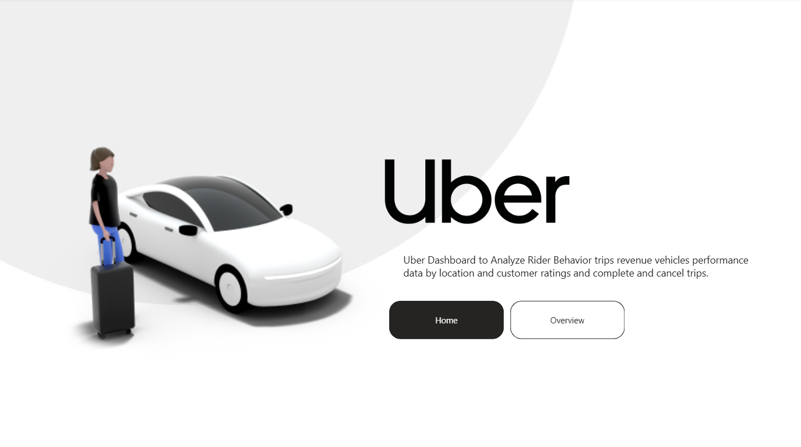
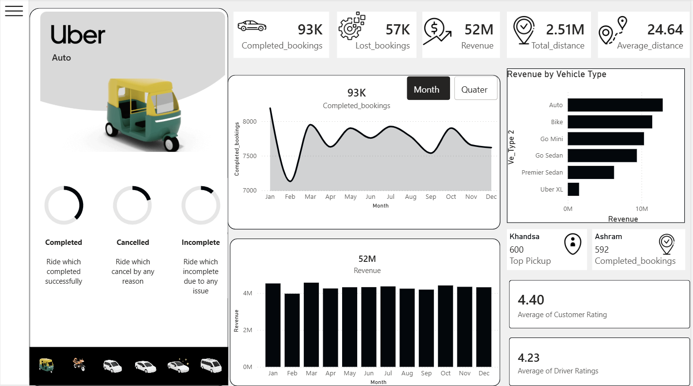

# Uber Bookings & Revenue Dashboard — Power BI

A Power BI dashboard built to analyze Uber's ride bookings, revenue, driver/rider ratings, and location trends. Designed to help identify booking losses, revenue drivers, and rider behavior patterns across vehicle types, time periods, and locations.

## 📁 Files

| File | Description |
|---|---|
| `UBER_Problems_and_Business_Requirements.pbix` | Power BI project file — open in Power BI Desktop |
| `Uber_Problems_and_Bussiness_Requirements.docx` | Business problem statement & requirements document |

## 📸 Screenshots

**Home Page**

**Overview Page**

> Screenshots are in the `screenshots/` folder. See [How to add screenshots](#-how-to-add-screenshots) below if you're adding more later.

## 📊 Report Pages

### 1. Overview
- **KPIs:** Completed Bookings, Lost Bookings, Revenue, Total Distance, Avg Distance
- Vehicle type filter
- Monthly analysis: Bookings Completed, Revenue
- Quarterly analysis: Bookings Completed, Revenue
- Revenue by Vehicle Type
- Top Pickup & Drop Locations (by booking count)
- Ratings: Avg Rider Rating, Avg Driver Rating

### 2. Vehicle
- Detailed breakdown by vehicle type
- Booking Count
- Revenue Contribution

### 3. Revenue
- Revenue by Customer
- Revenue by Vehicle
- Revenue by Payment Method
- Monthly and Quarterly trends

### 4. Rider
- Cancelled Rides by Reason
- Breakdown by Payment Method
- Monthly and Quarterly trends
- Detailed data table
- Rider segmentation: First-time, Return, and Regular Riders

### 5. Location
- Monthly Total Distance
- Total Distance by Vehicle
- Busy Time Slots
- Busy Areas

## 🎛️ Additional Features
- Hide/Show filter panel for cleaner layout and better spacing
- Multiple slicers/filters added across report pages for deeper drill-down

## 🛠️ Tools Used
- **Power BI Desktop** — data modeling, DAX measures, and report visuals

## 🚀 How to View
1. Download `UBER_Problems_and_Business_Requirements.pbix`
2. Install [Power BI Desktop](https://www.microsoft.com/en-us/power-platform/products/power-bi/downloads) (free)
3. Open the `.pbix` file to explore the interactive report

## 📄 Business Requirements
See `Uber_Problems_and_Bussiness_Requirements.docx` for the full breakdown of the business problem and requirements this dashboard was built to address.
